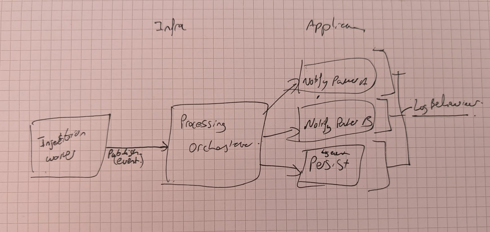

# IBT Message Processing Solution

## 1. Project Description


**Core Functionality:**
* Reads IBT XML messages from a configurable local file path.
* Parses the XML to extract key data points such as `EventType`, `ProductNameFull`, `IBTTypeCode`, and `ISIN`.
* Logs the `EventType` and a current timestamp (simulated database interaction).
* Processes data for different partners based on their specific requirements:
    * **Partner A:** Receives (simulated email) `ProductNameFull`, `IBTTypeCode`, `EventType`, and `ISIN`.
    * **Partner B:** Receives an XML file (`InstrumentNotification.xml`) containing the current timestamp and ISIN, but only if the `EventType` is `9097` and both fields are present.
* Designed to be adaptable for new partners, different message schemas, and varied communication protocols in the future.

## 2. Technologies Used

* **.NET 8:** The latest Long-Term Support (LTS) version of .NET, providing modern C# features and performance improvements.
* **C#:** Primary programming language.
* **Worker Service Template:** Used as the host for the background processing task.
* **MediatR:** For implementing in-process messaging, facilitating a clean separation of concerns using CQRS principles (Commands, Notifications, and Handlers). This helps in decoupling the components responsible for different processing steps.
* **Microsoft.Extensions.DependencyInjection:** For managing dependencies and promoting loose coupling.
* **Microsoft.Extensions.Logging:** For application logging.
* **Microsoft.Extensions.Configuration:** For managing application settings (e.g., input file path).
* **System.Xml.Linq & System.Xml.XPath:** For parsing the input IBT XML messages.
* **xUnit:** Testing framework for unit and integration tests.
* **Moq:** Mocking library for creating test doubles.
* **FluentAssertions:** Assertion library for more readable tests.

## 3. Architecture Overview

The solution loosely follows **Clean Architecture** principles to promote separation of concerns, testability, and maintainability.


* **Application Layer:** Contains the core business logic and use cases.
    * **Commands:** Represent specific actions to be performed (e.g., `LogEventCommand`, `NotifyPartnerACommand`).
    * **Notifications:** Represent events that have occurred (e.g., `IbtDataProcessedNotification`).
    * **Handlers (Command & Notification):** Implement the logic for processing commands and reacting to notifications. This is where the main work for database logging (simulated) and partner-specific processing resides.
    * **Interfaces:** Defines abstractions for infrastructure concerns (e.g., `IDatabaseLogger`).
    * **Behaviours (MediatR Pipelines):** Cross-cutting concerns like logging for command processing are implemented here (`LoggingBehavior`).
    * **Parsing DTOs:** `IbtData` record for structured data from XML.
* **Infrastructure Layer:** Contains implementations for external concerns.
    * **IngestionWorker (`BackgroundService`):** Acts as the entry point. It reads the input file, uses `XmlParser` to parse the content, and then publishes an `IbtDataProcessedNotification` via MediatR to kick off the application logic.
    * **XmlParser:** Responsible for reading the XML file from disk and parsing the XML string content into a `IbtData` object.
    * **DatabaseLoggerSimulator:** A concrete implementation of `IDatabaseLogger` that simulates database interactions by writing to the console.
    * File system interactions (e.g., writing `InstrumentNotification.xml` for Partner B) are also handled by specific application handlers but represent an infrastructure concern.
* **Domain Layer:** (Implicit) While not explicitly large for this exercise, the `IbtData` record and the rules for extracting data from the XML (e.g., how to identify the ISIN) can be considered part of the domain knowledge.
* **Test Projects:**
    * **Unit Tests:** Focus on testing individual components (e.g., `XmlParser`, MediatR handlers) in isolation.
    * **Integration Tests:** Verify the interaction between components, such as the `IngestionWorker` processing a file and triggering the MediatR pipeline.

**Processing Flow:**
1.  The `IngestionWorker` (hosted service) starts.
2.  It reads the specified IBT XML file using `XmlParser.ParseFromFile()`.
3.  The `XmlParser.ParseFromFile()` method reads the file content and calls `XmlParser.ParseXmlString()`.
4.  `XmlParser.ParseXmlString()` parses the XML string into a `IbtData` object.
5.  If parsing is successful, the `IngestionWorker` publishes an `IbtDataProcessedNotification` using MediatR.
6.  The `IbtDataProcessingOrchestrator` (an `INotificationHandler`) receives this notification.
7.  The orchestrator then sends specific MediatR commands (`LogEventCommand`, `NotifyPartnerACommand`, `ProcessPartnerBDataCommand`) for each required action.
8.  The `LoggingBehavior` (an `IPipelineBehavior`) intercepts these commands, logging information before and after their execution.
9.  Dedicated command handlers (`LogEventCommandHandler`, `NotifyPartnerACommandHandler`, `ProcessPartnerBDataCommandHandler`) execute the business logic for each command, interacting with services like `IDatabaseLogger` or performing file operations.

## 4. Setup and Running the Application

### Prerequisites
* [.NET 8 SDK](https://dotnet.microsoft.com/download/dotnet/8.0) or a compatible IDE (Visual Studio 2022, JetBrains Rider).

### Configuration
1.  **Input XML File:**
    * Place your sample IBT XML file (e.g., `IBT.xml`) in a location accessible to the application.
    * The path to this input file is configured in `appsettings.json` (or `appsettings.Development.json`). Create this file in the root of your main worker service project if it doesn't exist.
        ```json
        {
          "Logging": {
            "LogLevel": {
              "Default": "Information",
              "Microsoft.Hosting.Lifetime": "Information"
            }
          },
          "InputFilePath": "IBT.xml" 
          // Or an absolute path: "C:/Path/To/Your/IBT.xml"
          // Or a relative path from the execution directory: "TestData/IBT.xml"
        }
        ```
    * If using a relative path like `"IBT.xml"`, ensure the XML file is copied to the output directory during build. You can configure this in your `.csproj` file:
        ```xml
        <ItemGroup>
          <Content Include="IBT.xml">
            <CopyToOutputDirectory>PreserveNewest</CopyToOutputDirectory>
          </Content>
        </ItemGroup>
        ```
2.  **Output Directory (for Partner B):**
    * The `ProcessPartnerBDataCommandHandler` currently writes `InstrumentNotification.xml` to the application's current working directory. For integration tests, this is managed by setting the current directory. In a deployed scenario, you might want to make this path configurable.

### Running the Application
1.  Open the solution in your IDE or navigate to the root directory of the solution in your terminal.
2.  If you have multiple projects, ensure the Worker Service project (e.g., `IbtProcessingApp`) is set as the startup project.
3.  Run the application:
    * From IDE: Click the "Run" button.
    * From .NET CLI: Navigate to the Worker Service project directory and run `dotnet run`.

The application will process the configured input XML file upon startup. Check the console output for logs from the application, including simulated database logs and partner notifications. If Partner B's conditions are met, `InstrumentNotification.xml` will be created.

## 5. Running Tests

The solution includes unit and integration tests.
1.  Open the solution in your IDE.
2.  Use the Test Explorer window to discover and run tests.
3.  Alternatively, from the .NET CLI:
    * Navigate to the root of the solution or the specific test project directory.
    * Run `dotnet test`.

The tests cover:
* `XmlParser` file access and string parsing logic.
* Individual MediatR command handlers.
* The `LoggingBehavior` pipeline.
* End-to-end integration flow via the `IngestionWorker`.

## 6. Future Considerations 

* **Additional Partners:** New partners can be added by:
    1.  Creating a new MediatR command specific to the partner's needs.
    2.  Implementing a new `IRequestHandler` for that command.
    3.  Updating the `IbtDataProcessingOrchestrator` to dispatch this new command.
* **Different Message Schemas/Protocols:**
    * The `XmlParser` might need to be adapted or new parsers created (potentially behind an `IMessageParser` interface) if the input format changes.
    * For different output protocols (e.g., sending to a message queue, calling a web service), new infrastructure services implementing partner-specific interfaces would be developed.
* **Enhanced Database Logging:**
    * Replace `DatabaseLoggerSimulator` with a real database implementation (e.g., using Entity Framework Core) that implements `IDatabaseLogger`.
    * Expand `IbtData` and the `XmlParser` to extract more fields.
    * Update the `LogEventCommand` and `LogEventCommandHandler` (or create new ones) to handle the additional data.
* **Increased Message Volume:**
    * The current architecture with a Worker Service and MediatR is suitable for moderate loads.
    * For drastically increased volumes, consider:
        * Introducing an external message queue (e.g., RabbitMQ, Azure Service Bus, Kafka) to decouple ingestion from processing. The `IngestionWorker` would become a message consumer.
        * Scaling out consumer instances.
        * Optimizing database interactions (batching, asynchronous operations).
* **Input Source Flexibility:**
    * Currently, input is from a local file path. This could be abstracted (e.g., `IMessageSource` interface) to allow reading from message queues, network streams, or other sources in the future.
